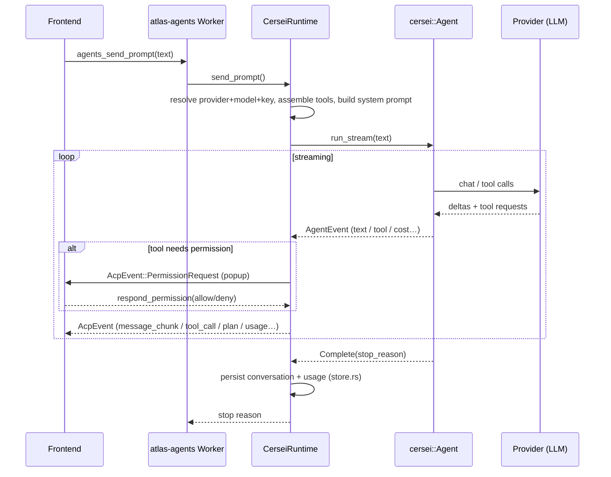

# Atlas (`atlas-cersei`) — the native in-process agent

> A plain-language walkthrough of how Atlas's own coding agent is built, how a
> turn flows end-to-end, and every tool it can use. Source: `crates/atlas-cersei/`.

---

## 1. The one-paragraph version

Atlas ships **three** AI agents you can pick in the chat: **Claude Code**, **Codex**,
and **Atlas**. The first two are *external programs* Atlas launches as subprocesses
and talks to over the **ACP** wire protocol (JSON-RPC). **Atlas** (this crate, code
name *Cersei*) is different: it runs **inside the Atlas process itself**. There is no
subprocess and no socket. It drives the **Cersei agent SDK** directly, and then
**translates** the SDK's event stream into the *exact same* `AcpEvent` shapes the real
ACP agents emit. That one trick — "look like ACP without being ACP" — is the whole
design: everything downstream (state, streaming, tool cards, permission popups, the UI)
is reused unchanged.

```
Claude Code  ─┐   subprocess  ┌─ speaks real ACP over JSON-RPC ─┐
Codex        ─┤   subprocess  ┘                                 ├─▶ same AcpEvent stream ─▶ same UI
Atlas        ─┘   in-process, drives Cersei SDK, FAKES AcpEvent ┘
```

---

## 2. Where it sits in the stack

```
┌──────────────────────────────────────────────────────────────────────┐
│ React frontend  (agent picker, chat, tool cards, permission popups)    │
└───────────────▲──────────────────────────────┬────────────────────────┘
        listen("atlas:agents")          invoke("agents_*")
                │                                ▼
┌───────────────┴────────────────────────────────────────────────────────┐
│ src-tauri/src/commands/agents.rs   (IPC verbs; registers memory search)  │
└───────────────▲──────────────────────────────┬─────────────────────────┘
                │                                ▼
┌───────────────┴────────────────────────────────────────────────────────┐
│ atlas-agents  — AgentManager + SessionWorker  (agent-agnostic)           │
│   backend.rs:  trait AgentBackend                                        │
│      ├─ AcpBackend     → atlas_acp::AgentRegistry   (Claude Code, Codex)  │
│      └─ CerseiBackend  → atlas_cersei::CerseiRuntime (Atlas)  ◀───────┐   │
└──────────────────────────────────────────────────────────────────────┼──┘
                                                                        │
┌───────────────────────────────────────────────────────────────────── ┴──┐
│ atlas-cersei  (THIS CRATE)                                                │
│   lib.rs       CerseiRuntime — sessions, turn loop, event translation     │
│   provider.rs  BYOK (provider,model,key) → cersei Provider                │
│   tools/       Atlas-owned basic tools (Read/Edit/Grep/List/Bash/Terminal)│
│   mcp.rs       connect MCP servers, expose their tools                    │
│   memory.rs    `search_memory` RAG tool (backend injected from Tauri)     │
│   context.rs   git snapshot + AGENTS.md/CLAUDE.md → system prompt          │
│   store.rs     persist/list/delete sessions on disk; read BYOK keys       │
└───────────────────────────────▲──────────────────────────────────────────┘
                                 │ drives directly
                  ┌──────────────┴───────────────┐
                  │ cersei::Agent  (external SDK) │  ← the actual agentic loop
                  └──────────────┬───────────────┘
                                 ▼
                   Anthropic / OpenAI-compatible provider (your BYOK key)
```

The seam that makes two very different agents interchangeable is the
`AgentBackend` trait in `atlas-agents/src/backend.rs`. The manager/worker only ever
call that trait. `CerseiBackend` is a thin wrapper that forwards each call into
`CerseiRuntime`. So Atlas is "an ACP agent" from the manager's point of view, even
though under the hood it never speaks ACP on a wire.

---

## 3. The files, one line each

| File | Lines | Job |
|------|------:|-----|
| `lib.rs` | 1555 | The runtime: session registry, the **turn loop** (`send_prompt`), the **event translator** (`translate_event`), and the **permission policy**. |
| `store.rs` | 396 | Save / load / list / delete sessions as JSON on disk; read BYOK keys. |
| `provider.rs` | 139 | Map `(provider, model, key)` → a boxed Cersei provider; default-model table + priority order. |
| `mcp.rs` | 110 | Connect configured MCP servers, surface their tools to the model. |
| `context.rs` | 106 | Build the per-turn repo context (git status + project docs) for the system prompt. |
| `memory.rs` | 95 | The `search_memory` RAG tool (retrieval backend injected from the Tauri layer). |
| `tools/` | — | **The tool layer.** Atlas-owned tools (`read/edit/list/bash/terminal/image`), the 10-strategy replacer (`replace.rs`), corrective errors (`errors.rs`), PTY rendering (`screen.rs`), output capping (`truncate.rs`), atomic writes (`atomic.rs`), and — beneath all of them — the gate: `policy.rs` (containment, read registry, approval cache, tier), `guard.rs` (the decorator applied to every tool), `classify.rs` (command classification), `sandbox/` (macOS Seatbelt). `atlas_coding_with()` (`tools/mod.rs`) is the registry seam. See `tools/ATTRIBUTION.md` and `plans/atlas-tool-layer-spec.md`. |

---

## 4. Core idea #1 — adapting Cersei events to `AcpEvent`

The Cersei SDK streams its own events (`AgentEvent`) as a turn runs. `translate_event`
in `lib.rs` converts each one into the `AcpEvent` the rest of Atlas already understands.
This adapter is the part most likely to harbor bugs, so it's split out and unit-tested
with scripted events (no provider, no network — see the `tests` module at the bottom of
`lib.rs`).

| Cersei `AgentEvent` | Emitted `AcpEvent` / action |
|---------------------|------------------------------|
| `TextDelta` | `agent_message_chunk` (streaming assistant text) |
| `ThinkingDelta` | `agent_thought_chunk` (streaming reasoning) |
| `ToolStart` (normal) | `tool_call` card (`in_progress`) |
| `ToolStart` **TodoWrite** | a **plan card** (`plan` update), *not* a tool card |
| `ToolEnd` | `tool_call_update` (`completed`/`failed`) + measure RTK savings. A tool that reported a structured diff gets a `diff` content block ahead of the text, so file-change counts come from what the tool did rather than from re-parsing its arguments. |
| `ToolEnd` for a TodoWrite id | **suppressed** (plan card already shown) |
| `CostUpdate` | `Usage` event (tokens + cost) |
| `CompactStart` / `CompactEnd` | `Compaction { active: true/false }` |
| `TurnComplete` | set stop reason, keep looping |
| `Complete` | set stop reason, **end** the turn |
| `Error` | fail the turn (caller decides cancel-vs-propagate) |

Tool names are also mapped to a UI icon category by `tool_kind()` (read / edit /
execute / fetch / other).

---

## 5. Core idea #2 — a turn, start to finish (`send_prompt`)

This is the heart of the crate. When you hit send:

```
 user prompt ─▶ CerseiRuntime::send_prompt(agent_id, session_id, text)
   │
   1. Resolve provider + model for the session; look up its BYOK API key.
   │      (no key / no model → friendly error pointing at Settings → API Keys)
   2. Build the provider           (provider.rs::build_provider)
   3. Assemble the TOOLSET  ───────────────┐  (see §6)
   4. Build the SYSTEM PROMPT:              │
   │     ATLAS_PROMPT (all of it)           │
   │   + git snapshot  (context.rs)         │
   │   + cwd + AGENTS.md/CLAUDE.md          │
   │   + MCP notes                          │
   5. cersei::Agent::builder()              │
   │     .provider / .tools / .working_dir  │
   │     .with_messages(history)   ← resume context
   │     .permission_policy(UiPolicy)  ← popups
   │     .cancel_token / .model / .max_turns(50)
   │     .auto_compact(true)               │
   │     .compression_level(RTK on/off)    │
   │     .thinking_budget(...)  ← Anthropic only, from "effort"
   │                                        │
   6. stream = agent.run_stream(text)       │
   │     for each AgentEvent:               │
   │         translate_event(...)  ─────────┘ emits AcpEvents through the sink
   │         (loop until Complete / Error / cancel)
   │
   7. Emit RTK "CompressionSaved" for the turn
   8. Fold this turn's tokens/cost into the session's cumulative usage
   9. Persist updated conversation to disk   (store.rs::save)
   └─▶ return the stop-reason token ("endturn" / "maxtokens" / "cancelled" / "refusal")
```

### Sequence diagram



A subtle but important detail: Cersei **rebuilds the agent each turn**, so its
cumulative token counters reset every turn. The runtime therefore keeps its **own**
running total (`CompressAccount` + `SessionEntry.usage`) so "tokens processed"
survives a reload.

---

## 6. The tools — what Atlas can actually do

The toolset is assembled fresh **per turn** in `send_prompt`. It is the union of:

```
   crate::tools::atlas_coding_with(cancel, policy, tier, caps)
                                   ← Atlas-owned + retained SDK tools, by tier
 + cersei::tools::planning()       ← EnterPlanMode, ExitPlanMode, TodoWrite
 + DelegateTool                    ← spawn parallel in-process sub-agents
 + AtlasSkillTool
 + SearchMemoryTool    (if a RAG backend is registered)
 + MCP proxy tools     (one per tool discovered on each connected MCP server)
```

**Every one of those is wrapped in `Guarded`** — including the MCP tools, which
are third-party code discovered at runtime and therefore exactly the ones that
must not bypass the gate. `guard_all` is applied to each group as it is added;
nothing in `send_prompt` may push an unwrapped tool.

### 6a. Coding tools (`crate::tools::atlas_coding_with()`)
The basic file/search/shell kit is **Atlas-owned** (a from-scratch reimplementation
modeled on opencode, MIT — see `src/tools/` + `tools/ATTRIBUTION.md`), so it works
reliably across every BYOK model rather than only strong ones:
**Read / Write / Edit / Grep / Glob / List / Bash**, plus the two that were missing:
**TerminalStart / TerminalWrite** (a persistent PTY session, for a dev server, a REPL, an
interactive installer, or a build too slow for Bash's timeout) and **ImageView** (gated on
the model's declared input modalities, so it is absent rather than failing mid-turn).

The crown jewel is `Edit`'s **10-strategy replacer** (`replace.rs`): a slightly-off
`old_string` (indentation / whitespace / line-ending / escape / typographic-punctuation
drift) still lands on the right span, with a guarded fuzzy tail (unique + not-oversized)
and a destructive-match guard so a wrong edit is never silently applied; on a genuine miss
it returns a corrective error showing the real nearby lines. `Edit` also takes an `edits`
array, applied in order and written only if every one succeeds — which is what the separate
`MultiEdit` tool used to be, for an identical schema and an identical operation.

Retained SDK tools (not reimplemented): `WebFetch / WebSearch`, plus `NotebookEdit`, `Glob`
and `FileWrite`. `PowerShell` is registered on Windows only.

**One way to change a file.** `Edit`, `MultiEdit`, `ApplyPatch` and `Write` were four
overlapping ways to do the same thing — 715 tokens of schema in every request, and four
chances for a weak model to pick the wrong one. `MultiEdit` folded into `Edit`, and the patch
tool is registered only in the shell-first tier, where it is the one way to change a file
without hand-composing shell redirection. That is the arrangement Codex ships: a single
`apply_patch` covering create, update, delete and move.

**A budget, enforced by a test.** The tool list is re-sent on *every request of every turn*,
so its size is multiplied by the number of tool calls a turn makes. On one basis throughout — the
env-gated search tools excluded, since their cost is opt-in — it once reached 10,626 bytes
across 16 tools without anyone noticing; folding the edit tools together took it to 8,593, and
later additions (the Atlas `Grep` at +503 bytes for context lines and a cheap default,
`TerminalKill`) were each argued against the budget. The enforced ceilings live in the test —
9,900 bytes structured, 4,100 shell-first — and
`the_tool_list_stays_within_its_context_budget` fails if the list outgrows them, naming the
largest tools when it does.

`atlas_coding_with()` (`tools/mod.rs`) is an explicit, hand-built vector, so any tool can
be swapped for an SDK fallback by flipping one line. Which tools are *visible* is the
tier decision (`tools/tiers.rs`): the **shell-first** tier omits the explicit file tools,
the **structured** tier includes them. Structured is the default until the BYOK evaluation
matrix exists, because over-provisioning tools degrades gracefully and under-provisioning
does not.

### 6a-i. Command output is rendered, not replayed (`tools/screen.rs`)
A pipe or a PTY carries the *instructions* a terminal follows, not the text it ends up
showing. `npm install` draws its spinner by emitting `ESC[1G` (cursor to column 1),
`ESC[0K` (erase to end of line) and one character — thousands of times. Handed to a model
verbatim that is pure cost: one observed session reached **172.8K tokens**, nearly all of
it cursor movements describing a spinner that renders to a single line. It also *destroyed*
output, because the buffer is capped and the spinner pushed everything before it off the
front.

`Screen` renders on the way **in**, for both `Bash` and the persistent terminal: the cursor
moves within the current line, a newline commits it, and CR / CHA / EL / backspace are
honoured so an overwrite overwrites. Colour, window titles and anything unrecognised are
dropped. `Bash` drains *committed lines* on every read — never at EOF — so memory stays
flat while a progress line rewritten across several reads still collapses.

It is deliberately **not** a terminal emulator: one line at a time, no row addressing, no
scroll regions, no alternate screen. Anything unrecognised is dropped rather than guessed
at, because dropping a colour code loses nothing a model needed where guessing at cursor
geometry would corrupt the transcript silently. `ESC[2J` clears only the current line for
the same reason — losing a build error to a `clear` is worse than showing stale text.

**A quiet session is an answer.** A live session with no new output used to say "(no new
output)" and invite another read, so a model asked to start a dev server polled it six
times — `npm run dev` never exits, so "is it done yet" has no answer it can reach by asking
again. It now says that reading again will not change anything, and gives both readings the
harness genuinely cannot tell apart: a server that has gone quiet has started, and a process
that has gone quiet may be waiting for input.

### 6b. The gate (`tools/policy.rs` + `tools/guard.rs`) — the layer beneath the tools
Every registered tool is wrapped by `Guarded`, which holds one shared `ToolPolicy` per
session. Nothing else in this crate performs containment, coercion, or the
read-before-edit precondition; a tool added later inherits all of it without knowing the
guard exists. That is the property that makes "installing an MCP server cannot create an
unguarded path" true rather than aspirational.

On every call, in this order:

1. **Coerce** the arguments against the tool's own declared schema — double-encoded JSON
   unwrapped, aliased field names renamed, fully-enclosing code fences stripped. The
   schema is what makes one shared alias table safe: `search → old_string` fires only for
   a tool that declares `old_string` and does *not* declare `search`.
2. **Contain** every path the call names and rewrite it to its canonical absolute form:
   absolutise against the workspace root, collapse `..` lexically, resolve symlinks on the
   longest existing ancestor, and reject anything outside the root. This replaces the old
   `CwdTool` decorator, which absolutised a bare `file_path` for the three tools someone
   remembered to wrap and let absolute paths through untouched.
3. **Short-circuit a repeat read.** A `Read` whose tool, canonical path and range were
   already answered, of a file that still looks exactly as it did then, returns a short
   stub instead of the file. The content is already in the conversation; sending it again
   costs a second full copy — for `crates/atlas-cersei/src/lib.rs` that is ~24k tokens
   per repeat — and tells the model nothing. Only `Read` is short-circuited: `Grep` and
   `List` return a fraction of a file and are cheap to repeat. The answered-reads record
   carries its **own** snapshot of the file rather than consulting the read registry,
   because a write *refreshes* the registry — so a read taken after an edit would look
   unchanged and the model would never see its own change.
4. **Check freshness** for a write-class call, *before* execution. No read record → refuse
   with "read it first". A record that no longer matches the file → refuse, because the
   user changed it in their editor and applying the edit would silently overwrite them.
5. **Execute**, with `working_dir` set to the canonical root.
6. **Record** the read (or refresh the record after a write) and emit one telemetry line:
   tool name, tier, outcome, latency. No arguments, no paths, no content. A *provably read-only*
   shell command also registers the files it named (`classify::read_paths`), which is what makes
   read-before-edit reachable in the shell-first tier, where there is no `Read` tool to register
   anything. It runs after execution and outside containment on purpose: reading a file outside the
   workspace stays allowed, it simply registers nothing.

Classification, the approval cache, and the prompt itself sit in `ToolPolicy::decide`,
which `UiPolicy` calls *before* the runner dispatches. That split is deliberate: the
runner already hands the tool input to the permission policy, so a per-command verdict
needs no vendored-runner patch. It is also what makes "Allow for this session" real —
cersei's `AllowForSession` is advisory and nothing stored it, so the identical command
prompted again on the very next call.

**Classification may skip a prompt; it may never block** (`tools/classify.rs`). Commands
are tokenised and parsed, never substring-matched. A small whitelist of read-only commands
skips the prompt; any redirect, subshell, command substitution, backtick, glob, brace or
tilde expansion fails closed. The destructive list only *forces* a prompt the approval
cache cannot suppress. There is no `Forbidden` outcome and no code path that produces one,
because a keyword list is not a security control — its protection depends on the spelling.

### 6b-i. The enforcement ladder (`tools/sandbox/`)
The strongest enforcement the host provides, selected at runtime from one binary:

| Tier | Enforcement | Reached when |
|---|---|---|
| 0 | OS sandbox + containment + approvals | macOS with `/usr/bin/sandbox-exec` |
| 1 | Containment + approvals | sandbox unavailable (Linux, Windows) |
| 2 | Approvals only | not yet reachable — no setting selects it |
| 3 | Today's behaviour | never selected automatically; the floor |

Tiers 2 and 3 are constructible and tested but nothing selects them: the containment
toggle they exist for is not a setting a user can reach yet. In practice every host is
at tier 0 or tier 1.

The macOS profile composes Seatbelt policy data vendored from Codex (Apache-2.0, see
`tools/sandbox/ATTRIBUTION.md`) with workspace-scoped write rules and a deny list covering
credentials and browser profiles. Paths are `-D` parameters, never interpolated into the
profile text, so a workspace name containing a quote cannot rewrite the policy.

Reads outside the workspace are permitted apart from that deny list. This is a deliberate
trade: a read whitelist tight enough to be meaningful breaks `cargo`, `npm` and `go`, and a
sandbox users turn off protects nobody. `tests/sandbox_tier0.rs` proves the behaviour
against the real kernel rather than asserting on the profile text.

**The tier in force is rendered in the composer's permission-mode picker**
(`cersei_enforcement`), because silent degradation is the failure the ladder exists to
prevent.

### 6b-ii. Search backend — in-process, no `rg` binary
`Grep / Glob / List` are **in-process**: `Glob` is the SDK's, `Grep` is Atlas-owned over the
SDK's search primitive, and `List` walks via `ignore` directly — all three on ripgrep's
`ignore` + `grep` library crates. Nothing shells out to an `rg` binary, so the tools behave
identically on a stock machine and there is nothing to bundle with the packaged `.app`.

**Why `Grep` is Atlas-owned: the search backend was never the problem.** The SDK tool has one
output shape — every match as `file:line:content`, capped at 250, with nothing saying the cap
was hit. Three consequences, all of which reached the user as burnt context:

* *The cheap question could not be asked.* "Which files mention this?" wants a path list.
  Measured on this repo, `policy` costs 8,279 tokens as match lines and 500 as paths with
  counts. `output_mode` now defaults to `files`, densest file first.
* *The cap was silent, and raced.* The primitive quits the parallel walk when a shared counter
  crosses the cap and sorts *afterwards*, so the survivors arrive neatly ordered and look
  complete. Atlas scans to `SCAN_LIMIT` (20_000) instead — far above any cap it displays — so
  the walk completes, the total is exact, and the same query twice gives the same answer. Every
  cap reports the true total.
* *A bare match line cannot be edited from.* With no surrounding lines the model cannot build
  an `old_string`, so every location question became a whole-file `Read`. Locating an edit site
  in `guard.rs` cost 8,329 tokens that way; with `context` lines it costs 435. Overlapping
  windows merge, so a shared line is never paid for twice.

`Grep` deliberately does **not** call `record_read`. Context lines are a window, not the file,
and letting them satisfy read-before-edit would reopen the staleness hole §6d had to close for
shell reads.

### 6c. Planning tools (`cersei::tools::planning()`)
`EnterPlanMode` / `ExitPlanMode` / `TodoWrite`. **TodoWrite is special**: instead of
rendering as a raw tool card, the runtime maps it to an ACP **plan card** (the same
live to-do surface Claude Code uses). See `emit_plan`.

### 6d. `delegate` — parallel sub-agents
The `DelegateTool` (from `cersei-agent`) lets Atlas spawn **parallel in-process
sub-agents** — like Claude Code's *Task* or Codex's *spawn_agent*. Each child:
- gets a **fresh conversation** + the **same coding toolset**, behind the **same gate**
  (a delegate must not be a way around it),
- runs on the **same provider/model** (rebuilt via a `ProviderFactory`),
- **cannot delegate further** (depth-capped — children can't spawn children),
- runs **concurrently** (the batch runs several at once) and reports a summary back.

### 6e. `search_memory` — RAG grounding (`memory.rs`)
A read-only tool that searches Atlas's **indexed project memory** (prior decisions,
conventions, codebase summaries) and returns the most relevant snippets. The seam
is frozen and unchanged: `MemDoc { title, source, text }` +
`MemorySearchFn(cwd, query, limit) -> Vec<MemDoc>`, injected via a registered async
callback (`register_memory_search`, wired in `commands/agents.rs`). The closure
takes **no agent-type parameter**, so all three agents (Claude Code / Codex /
Cersei) ground through the exact same retrieval path. Until the backend is
registered, the tool simply isn't added.

**What backs the callback** (rebuilt — see `plans/atlas-cersei-rag-replan.md` and
`crates/atlas-memory/MIGRATION.md`): a new low crate **`atlas-memory`** (no Tauri,
never depends on `atlas-cersei`) owns a per-project `MemoryEngine`:

- **On-device MiniLM → usearch HNSW.** `MiniLmProvider` (Cersei's `EmbeddingProvider`
  trait, wrapping `atlas-embed`'s 384-d CPU MiniLM) feeds a persistent
  `usearch 2.25.3` HNSW index — replacing the old in-Tauri **brute-force O(n)
  cosine** over a flat `memory-index/index.json`. A micro-benchmark (Step 10) put
  HNSW at ~120× the brute-force query throughput on a 4k-vector corpus. The default
  retrieve path performs **no network call**.
- **Decoupled indexing.** A single background `MemoryIndexer` (Tokio task + debounce
  + FS watcher, in the Tauri layer) does ALL embedding/persistence off the chat hot
  path, across all open projects, keyed by `cwd`. This fixes the old "index never
  rebuilt mid-session" staleness bug.
- **Graph memory.** Cersei `GraphMemory` (Grafeo) holds structured facts /
  relationships / topic tags as a **down-weighted** secondary contributor; the
  embedding side stays the authoritative recall path.
- **Fused retrieve.** `MemoryEngine::retrieve` applies the 0.30 cosine floor on the
  raw similarity, RRF-fuses embedding + graph, Jaccard-dedups, and (only when local
  memory is sparse) blends low-weight global cross-project hits.
- **Gated extraction + global memory.** Native session extraction (behind the
  default-OFF `ATLAS_NATIVE_EXTRACTION` flag, A/B'd against the legacy
  `memory_compile` distill) and AutoDream consolidation feed a global store under
  `~/.atlas/memory/`.

The legacy brute-force `memory_retrieve` path and the `memory_compile` distill are
**retained as documented rollback fallbacks** pending live runtime validation.

### 6f. MCP tools (`mcp.rs`)
Cersei 0.1.9 collects MCP server configs but never connects them, so this crate drives
`cersei::mcp` itself: it reads `<config_dir>/mcp-servers.json`, connects the servers
**once** (cached for the app session), and exposes each discovered tool as a normal
Cersei tool that proxies calls to the server. MCP tools are treated as `Execute`
permission level (arbitrary third-party code → they prompt unless you're in Bypass).

---

## 7. Permission modes — who gets to ask before acting

Every tool call passes through `UiPolicy::check`. The session has a **mode**, and the
mode decides whether the tool runs silently, is blocked, or pops a permission request
to the UI.

```
                         ┌──────────────────────────────────────────────┐
  tool wants to run ───▶ │  mode_kind(session.mode)                      │
                         └──────────────────────────────────────────────┘
                            │           │            │            │
                         Bypass        Plan      AcceptEdits      Ask (default)
                            │           │            │            │
                    allow  everything   │      allow file edits   │
                            │      allow read-only  & reads;       │
                            │      deny writes      prompt for     │
                            │      ("read-only")    shell/danger   │
                            │                                      │
                            ▼                                      ▼
                       (no popup)                    Forbidden? → auto-deny
                                                     else → POPUP, block tool,
                                                            await user decision
```

The four advertised modes (`modes_blob`): **Ask** (`default`), **Accept edits**
(`acceptEdits`), **Plan** (`plan`), **Bypass** (`bypass`).

A neat robustness detail: `mode_kind()` **normalizes aliases** from other agents'
vocabularies — `bypassPermissions` (Claude), `danger-full-access` (Codex), `read-only`,
`auto`, etc. — so a mode id seeded by a cross-agent picker still does the right thing.
(This fixed a real bug where "Bypass" silently fell through to prompting on every action.)

When a popup is needed: the policy mints a request id, stashes a `oneshot` sender in
`SessionEntry.pending`, emits `AcpEvent::PermissionRequest`, and **blocks the tool** on
the channel until `respond_permission` (allow once / allow for session / reject) or a
cancel resolves it.

---

## 8. Providers & BYOK (`provider.rs` + `store.rs`)

Atlas is **bring-your-own-key**. Keys live in `<config_dir>/byok-keys.json` (written by
the Tauri `byok_*` commands; this crate only reads them).

- **Anthropic** → native `Anthropic` provider.
- **Everything else** (OpenAI, Google, xAI, DeepSeek, Mistral, Groq, Together,
  Fireworks, DeepInfra, Cerebras, Perplexity, OpenRouter, Cohere) → the
  **OpenAI-compatible** client with a per-provider base URL.

When a session opens and the UI hasn't pinned a model, the runtime auto-picks the first
configured provider by **priority** (`PROVIDER_PRIORITY`, Anthropic first) and its
default coding model (`default_model_for`). `set_model` accepts `"provider/model"` or a
bare model id, and is careful not to mis-split model ids that legitimately contain a
slash (e.g. `Qwen/Qwen3-Coder`).

**Reasoning effort** (low/medium/high/max) maps to a **thinking budget**, applied
**only for Anthropic** (the only provider exposing a usable per-request budget today).

**RTK compression** (`cersei-compression`) shaves tool-output tokens — `Minimal` when
on (safe savings, the default), `Off` when the user disables it. The runtime mirrors
the same compression to *measure* and report savings, because the SDK applies it but
never reports the number.

---

## 9. Persistence & resume (`store.rs`)

Sessions are stored as JSON at:

```
<config_dir>/cersei-sessions/<cwd-hash>/<session_id>.json
```

- `<cwd-hash>` namespaces sessions **per project** (a `DefaultHasher` of the cwd).
- The file holds the raw Cersei conversation + provider/model + cumulative usage.
- **Resume**: `load_session` feeds the stored messages back via `Agent::with_messages`
  so context continues; `replay_session` rebuilds a UI-neutral transcript
  (`ReplayItem`s) so the chat repaints on reload.
- **Sidebar**: `list()` returns `SessionMeta` shaped *exactly* like the frontend's
  `ClaudeSessionMeta` (same as Codex), so all three agents merge into one session list
  with no special-casing.
- **Corpus**: `corpus_sessions()` flattens conversations so Atlas's own chats are
  searchable in Memory ▸ Chat / Graph (parity with Codex threads).
- **Delete** guards that the resolved path stays inside `cersei-sessions` before
  removing; a missing file is treated as success.

---

## 10. System prompt — grounding the agent in *your* repo (`context.rs`)

**Atlas owns its prompt outright**, as Claude Code and Codex own theirs.
`build_system_prompt` is not called. Each turn the prompt is:
- **`ATLAS_PROMPT`** — the whole behavioural spec, at the top of `lib.rs`. It is the
  agent's personality and worth reading.
- **git snapshot** — branch, last 10 commits, up to 40 dirty files, user name.
- **project docs** — `AGENTS.md` and `CLAUDE.md` (each capped at 8 KB).
- **cwd** + per-server MCP notes.

The last four are rendered by `context::dynamic_sections`, so the agent is re-grounded
in the actual repo state every turn rather than running off a static prompt.

**Why Atlas stopped appending to the SDK's base sections.** They described a different
product and contradicted this one. They advertised an **LSP tool three times** that Atlas
does not register, a Bash *"background mode"* that does not exist (that is
`TerminalStart`), skills loaded from `.claude/commands/*.md` when Atlas reads
`.atlas/agent-skills`, and memory *"injected into your context automatically"* when Atlas
exposes it as a tool. They also contradicted Atlas head-on, and came **first**:

| | base said | Atlas said |
|---|---|---|
| stopping | *"Never stop at surface-level answers"*, *"be thorough and structured, use tables, lists, and sections"* | *"The moment you can answer, answer and stop"*, *"a one-line question gets a one-line answer"* |
| todos | *"Use VERY frequently"*, *"ALWAYS use the TodoWrite tool"* | *"Skip it for simple one- or two-step tasks"* |
| shell | *"prefer using Bash (with grep, find)"* | *"use the dedicated file tools, not the shell"* |

The base even disagreed with itself on the last one — *"Tool usage policy"* said prefer
Bash with `grep`/`find` while *"Tool use guidelines"* two paragraphs later said prefer
`Grep` over `grep` and `Glob` over `find`. A weak model handed contradictory instructions
does not pick the better one; it oscillates, which is what made the agent feel
unpredictable. And `build_system_prompt` emitted `__SYSTEM_PROMPT_DYNAMIC_BOUNDARY__` as a
literal line — an internal cache marker nothing in the SDK strips, sent to the model in
the middle of its instructions.

**The rule that keeps it from drifting again:** the prompt states *policy, not an
inventory*. Tool schemas already travel with every request, so the prompt never claims a
specific tool exists — it says the tool list is the authority.

**Written to Anthropic's prompting guidance.** Each kind of instruction sits in its own XML
section, so "how to format a reply" cannot be mistaken for "when to ask before acting".
Rules carry their motivation wherever the reason is not self-evident, because a model that
knows *why* generalises the rule to cases the text did not cover. Framing is positive —
what to do rather than what to avoid — everywhere except the safety prohibitions, where the
prohibition is the point.

It is **prose, not bullets, on purpose**: prompt style carries into output style, and the
complaint that started this work was a one-line question answered with a bulleted
architecture essay. `the_prompt_is_sectioned_and_asks_for_prose` fails if a bullet
reappears. Two budget tests keep the cost visible —
`the_prompt_stays_within_its_context_budget` and, for the tool list,
`the_tool_list_stays_within_its_context_budget`. Both were raised once, deliberately, with
the reason recorded at the constant.

**Tool descriptions document what they return**, and `Edit` shows its two accepted argument
shapes as worked examples — a JSON Schema says what is structurally *valid*, never which
combination is *meant*, and `Edit` taking either a flat replacement or an `edits` array is
exactly that ambiguity. The examples live in the description text rather than a schema
`examples` keyword on purpose: Atlas is BYOK, and a restricted function-calling schema
(Gemini's, for one) may reject an unknown keyword and break tool calls outright, where a
description is always just a string.

Not applied from that guidance: `defer_loading` (Tool Search) and `allowed_callers`
(Programmatic Tool Calling) are Claude API beta fields with no equivalent in the SDK's tool
trait, and the advice to dial back assertive language assumes a model that over-triggers —
the opposite of the weak BYOK models this harness exists to carry.

---

## 11. Mental model / cheat-sheet

- **It's not really ACP.** It's an in-process Cersei agent wearing an ACP costume so it
  can reuse Atlas's whole agent pipeline.
- **`lib.rs` is 90% of it.** `CerseiRuntime` (state + turn loop) + `translate_event`
  (the costume) + `UiPolicy` (permissions).
- **Tools = `atlas_coding_with()` + `planning()` + `delegate` + `search_memory` + MCP**,
  every one of them wrapped in `Guarded` (containment, coercion, freshness) by the
  registry — the old per-tool cwd wrapper is gone.
- **BYOK, Anthropic-native + OpenAI-compatible for the rest.**
- **Per-turn rebuild** means the runtime owns cumulative usage and persistence itself.
- **The adapter is the fragile part** — and it's the part with unit tests.

### Where to look when…
| You want to… | Go to |
|--------------|-------|
| change how a Cersei event renders in the UI | `translate_event` / `emit_*` in `lib.rs` |
| add/remove a tool | `atlas_coding_with()` in `tools/mod.rs` (the registry seam) |
| change how Edit matches drifted `old_string` | `tools/replace.rs` (the 10-strategy replacer) |
| change permission behavior | `UiPolicy::check` + `mode_kind` in `lib.rs` |
| add a provider / change default model | `provider.rs` |
| change what repo context the agent sees | `context.rs` |
| change session storage / resume | `store.rs` |
| debug "file not found" / "outside the workspace" | `tools/policy.rs` (`ToolPolicy::contain`) |
| change what prompts and what does not | `tools/classify.rs` + `ToolPolicy::decide` |
| change what the sandbox permits | `tools/sandbox/seatbelt.rs` + the vendored `.sbpl` |
| wire MCP | `mcp.rs` + `<config_dir>/mcp-servers.json` |
| connect it to the rest of Atlas | `atlas-agents/src/backend.rs` (`CerseiBackend`) |
```
